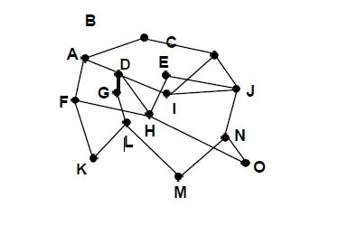
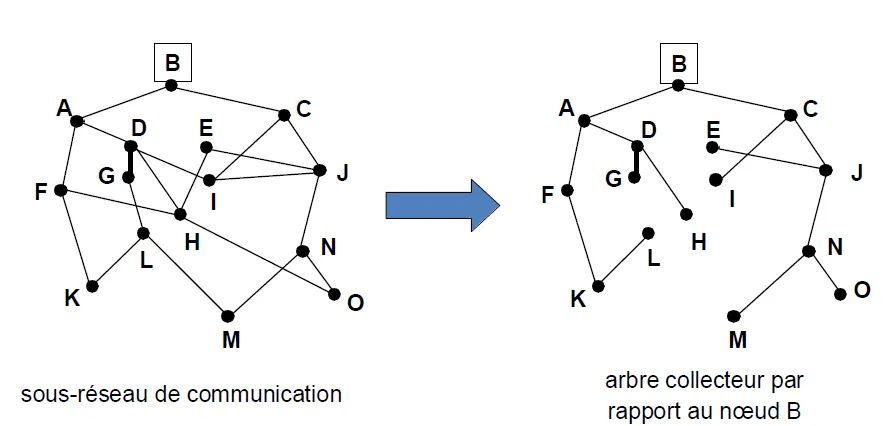
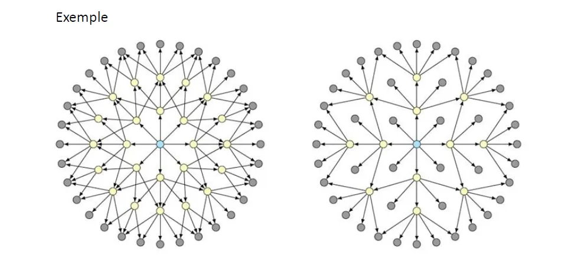

# 🖧 Techniques d’interconnexion  

## 📡 Amplification
- Mécanisme de régénération et de répétition du signal
- Maintien de la même qualité du signal dans les segments raccordés
## 📦 Encapsulation  

- Mécanisme utilisé lorsque deux réseaux de technologie identique doivent être interconnectés par un troisième de technologie différent 
  
- Chaque unité de données est enveloppée selon le format du protocole utilisé pour relier les deux réseaux  

## 🔧 Adaptation
- Mécanisme utilisé si les protocoles sont proches  
 
## 🔄 Conversion
- Mécanisme utilisé lorsque les réseaux à interconnecter sont hétérogènes
- Deux cas : conversion de service ou conversion de protocole  

## 🛠️ Équipement d’interconnexion :

- Routeur : Équipement de Niveau 3
- Switch, Pont : Équipement de Niveau 2
- Hub, Répéteurs : Équipement de Niveau 1  

# 📊 Représentation d’un sous-réseau de communication par un graphe

- Sous-réseau de communication
    - Nœuds de transfert : routeurs ou commutateurs
    - Lignes de communication entre les nœuds de transfert
    - Hôtes utilisant le sous-réseau : non représentés, graphe orienté ou non
    - Routeur ou commutateur : nœud du graphe
    - Ligne de communication : arc
        - Simplex ou duplex asymétrique : 1 ou 2 arc(s) orienté(s)
        - Duplex symétrique : 1 arc non orienté

         

# 🌳 Notion d’arbre collecteur  

  

# 🌊 Routage par inondations  

# 🧭 Autres routages

## ➡️↗️⬅️ Routage multi chemins

- Envoi aléatoire vers l’une des lignes de sorties présélectionnées
- Envoi en fonction d’une politique

## 🔀 Routage fondé sur les flux

- Optimisation des chemins en fonction des caractéristiques prévues des flux

## 🥔🔥 Routage par technique de la «patate chaude »(hot potatoe)

- Envoi vers la ligne de sortie la moins chargée

## 📏 Routage à vecteur de distance

- Fondé sur l’échange des routes connues entre routeurs
