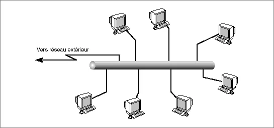
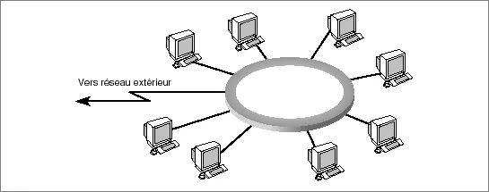
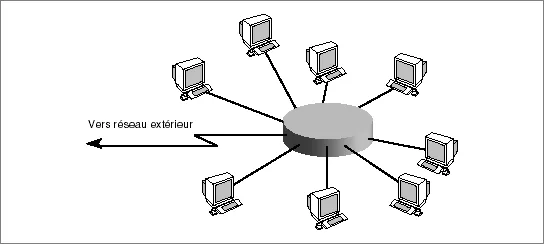
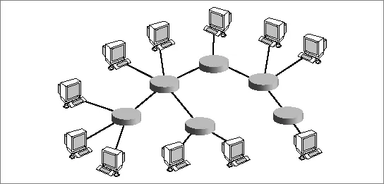
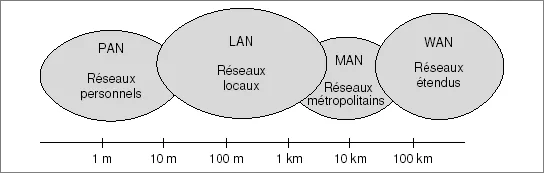
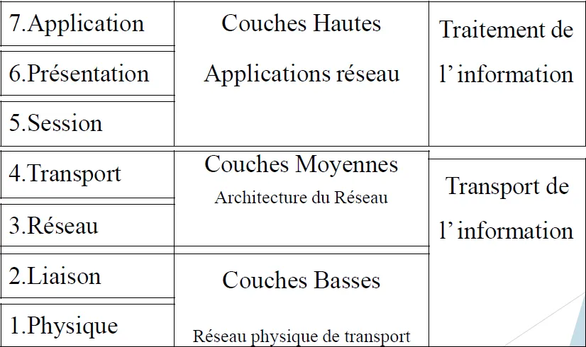
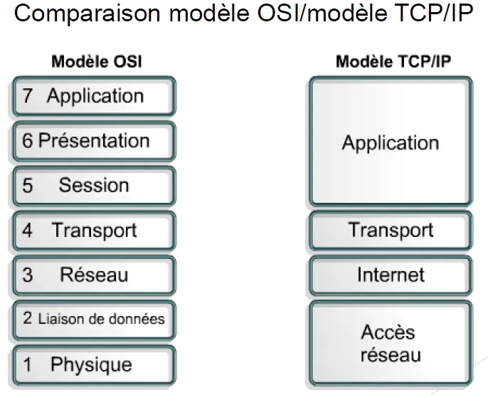

# 📝 Présentation Générale

💡**Réseaux : Ensemble de nœuds interconnectés permettant l’acheminement de l’information**

### 🖥️ Quel sont ces nœuds :

- Hôte (terminaux)
    - Exécutent des applications Web, Email…
    - Génèrent de l'information ou utilisent l'information, générée par d'autres
- Équipements Réseaux
    - Acheminements de l'information
    - Assurent des fonctionnalités spécifiques

### 🌐 Comment s'interconnecte ils ?
- Lignes de transmission
    - Transporte l'info d'un nœud à l'autre
    - Câble cuivre, fibre, ondes

💡*La vocation d'un réseau de communication est de transporter des informations d'un point A émetteur au point B récepteur*  

# 💡 Qu’est ce que l’information ?

Information = données, sous forme binaire 

Données discrètes:

- Suite d’éléments appartenant à un ensemble dénombrable

Données continues:

- Eléments résultant de la variation continue d’un phénomène physique

L’information est transportée  sous différents formats (messages, paquets, cellules,…)
et suivant des règles données => **PROTOCOLES**

# 🕸️ Types de réseaux 

## 📡 Mode de transmission 

- Mode point-à-point :
    - Le support physique ne relie qu’une paire de nœuds
- Mode multipoint (ou à diffusion) :
    - Partage du support de transmission entre différents nœuds
  
## 🗺️ Topologies 

### 🚌 Bus  
- Le support est partagé
- Toutes les stations peuvent émettre en même temps
- Le réseau gère les collisions
  
      

### 🔄 Anneau  
- Les stations peuvent émettre lorsqu'elles y sont invitées.
- Les stations se passent la parole à tour de rôle.
- Le débit est à peu près fixe.  

      

### ⭐ Étoile  
- Le nœud gère les conflits
- Chaque station dispose du débit maximum.
- Le nœud donne souvent accès à un serveur  

      

### 🌳 Arbre 
- Des étoiles interconnectées
- Fonctionne comme un bus actif
- Le nombre de nœuds peut être limité

      

# 🎯 Objectif des réseaux

- S'échanger de l'information
- Homogénéité

# 📏 Catégories par tailles  

- **Lan : Les réseaux locaux informatiques (en anglais LAN, Local Area Network) sont destinés aux  communications locales, sur de courte distance, quelque km maximum.**  

      

# 🏛️ Architecture des réseaux

## 🪜 Modèle OSI 
  

### 🧩 Rôles des couches
- Couche physique : **Couche Basse**
  - Déplacer les bits 
- Couche Liaison : **Couche Basse** 
  - Transmettre l’information sous forme de trames entre   deux nœuds du réseau.
- Couche Réseaux : **Couches Moyennes** 
  - Contrôler le cheminement des données dans le réseau
- Couche Transport : **Couches Moyennes**
    - Récupérer les erreurs laissées par les couches précédentes
- Couche Session : **Couches Hautes**
  - Gérer la session réseau entre deux utilisateurs.
- Couche Présentation : **Couches Hautes** 
  - Convertir les données binaires en objets.
- Couches Applications  : **Couche Hautes** 
  - Gérer la sémantique de la transaction 

### 🗣️ Conversation OSI 

Toutes les couches utilisent **l’encapsulation**

**Encapsulation : L'encapsulation en réseaux consiste à ajouter des en-têtes et des métadonnées aux données pour les transmettre selon les protocoles de chaque couche**