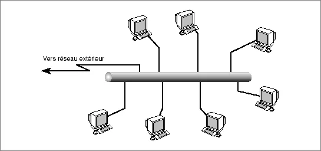

# Présentation Générale

💡**Réseaux : Ensemble de nœuds interconnectés permettant l’acheminement de l’information**

### Quel sont ces nœuds :

- Hôte (terminaux)
    - Exécutent des applications Web, Email…
    - Génèrent de l'information ou utilisent l'information, générée par d'autres
- Équipements Réseaux
    - Acheminements de l'information
    - Assurent des fonctionnalités spécifiques

### Comment s'interconnecte ils ?
- Lignes de transmission
    - Transporte l'info d'un nœud à l'autre
    - Câble cuivre, fibre, ondes

💡*La vocation d'un réseau de communication est de transporter des informations d'un point A émetteur au point B récepteur*  

## Qu’est ce que l’information?

Information = données, sous forme binaire 

Données discrètes:

- Suite d’éléments appartenant à un ensemble dénombrable

Données continues:

- Eléments résultant de la variation continue d’un phénomène physique

L’information est transportée  sous différents formats (messages, paquets, cellules,…)
et suivant des règles données => **PROTOCOLES**

## Types de réseaux :

### Mode de transmission :

- Mode point-à-point :
    - Le support physique ne relie qu’une paire de nœuds
- Mode multipoint (ou à diffusion) :
    - Partage du support de transmission entre différents nœuds
  
### Topologies :

#### Bus
- Le support est partagé
- Toutes les stations peuvent émettre en même temps
- Le réseau gère les collisions
  
  