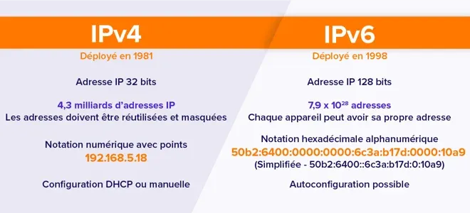

# 🌍 IPV4 ou IPV6 

💡 *Une adresse IPv4 est une suite de 32 bits (4 octets) exprimée en décimales à point, en séparant chacun des octets par un point. Elle possède un masque, une suite de 32 bits.*

Pour calculer le nombre d'adresses, on en enlève toujours 2 car il y a :
- La première adresse : l’adresse réseau
    - Exemple : 168.100.10.0
- La deuxième adresse : l’adresse de diffusion du réseau
    - Exemple : 168.100.10.255

# 🗂️ Les classes d’adresses 

À l’origine, l’adressage IPv4 regroupait les plages d’adresses en cinq classes (seules les trois
premières A, B et C sont présentées ici) : c'était l'adressage par classe. 

Les classes d’adresse A, B et C définissaient des réseaux d’une certaine taille, ainsi que des blocs
d’adresses particulières pour ces réseaux.

### **Classe A**

- **Plage** : 1.0.0.0 à 126.255.255.255
- **Utilisation** : Grands réseaux
- **Exemple** : **10.0.0.1** (utilisé souvent dans les grandes entreprises).
- **Masque par défaut** : 255.0.0.0 (seule la première partie identifie le réseau).

### **Classe B**

- **Plage** : 128.0.0.0 à 191.255.255.255
- **Utilisation** : Réseaux de taille moyenne
- **Exemple** : **172.16.0.1** (souvent pour des organisations de taille moyenne).
- **Masque par défaut** : 255.255.0.0 (les deux premières parties identifient le réseau).

### **Classe C**

- **Plage** : 192.0.0.0 à 223.255.255.255
- **Utilisation** : Petits réseaux
- **Exemple** : **192.168.1.1** (souvent utilisé pour les réseaux domestiques).
- **Masque par défaut** : 255.255.255.0 (les trois premières parties identifient le réseau).