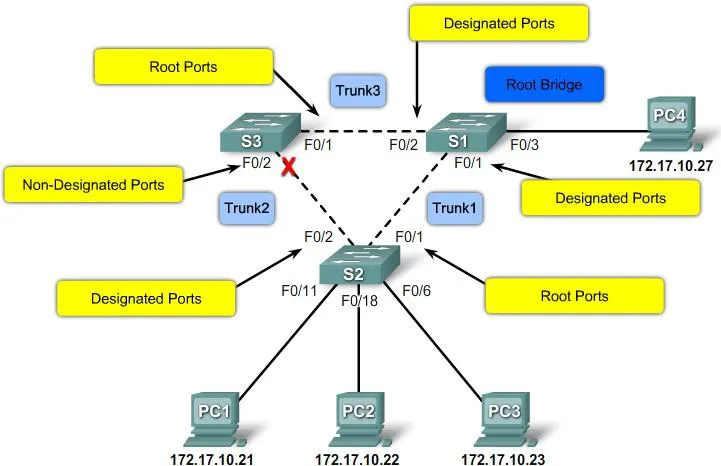

# ♻️ La Redondance ?

## 🔗 La redondance sur les liens

- Permet d'avoir plusieurs chemins en cas d'une défaillance d'un lien
- Problème : un broadcast provenant de PC1 ne pourra jamais être arrêté !
- Permet de supporter la perte d'un lien ou d'un équipement
- Problèmes : un PC peut recevoir plusieurs trames

💡 Une solution : **le Spanning Tree**

- Les ports qui génèrent des boucles sont automatiquement désactivés

# 🌳 Spanning Tree

- Le switch qui possède la plus petite **Bridged Identity (BID)** est élu **Root**
- Les ports des switch sont appelés :
    - Root Ports s'ils sont connectés au Root Bridge (ou Root Switch)
    - Designated Ports s'ils ne sont pas Root Port et s'ils autorisent le trafic à circuler
    - Non-designated Ports s'ils bloquent le trafic
  
Chaque chemin sur le port d’un switch a un coût, qui est évalué pour choisir le moins cher 

## ⚙️ Configuration sur Cisco Packet Tracer

Changer le coût d'un port

- `Switch(config-if) #spanning-tree costnumber`

Revenir au coût par défaut

- `Switch(config-if) #no spanning-tree cost`

Vérifier l'état du Spanning Tree sur un switch

- `Switch# show spanning-tree`

Cela permet de connaître le Root ID, le BID du switch et le coût de chaque port vers le Root Bridge  

# 🔐 L’introduction a la sécurité du protocole HSRP

HSRP est un protocole de redondance pour établir une passerelle par défaut, *développer par Cisco*. Il permet d’éviter le point unique de défaillance dans la répartition de l’accès d’un réseau à la passerelle par défaut (routeur, pare-feu)  

## 📜 Liste des commandes permettant d’implémenter et maîtriser le protocole HSRP

- La commande `«standby priority xxx»` définit une priorité au routeur. Celui qui possédera la plus grande valeur sera élu actif. Si la configuration du routeur ne stipule pas la priorité, alors la valeurs par défaut de 100 sera appliquée.

💡*En cas d'égalité dans la priority on prend l'adresse MAC la plus petite*

- La commande `«standby preempt»` permet d’accélérer le processus d’élection.

- La commande `«standby ip [xxx.xxx.xxx.xxx](http://xxx.xxx.xxx.xxx/)»` indique l’adresse IP virtuelle partagée entre les deux routeurs.
