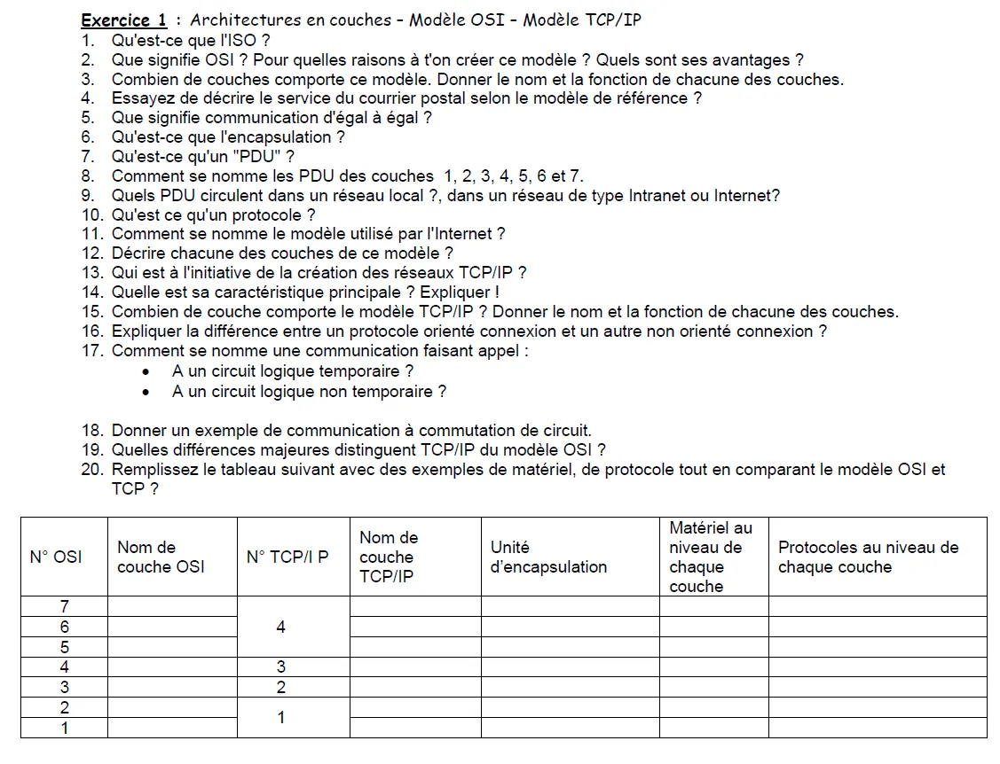

# 📝 Énoncé

# ✅ Réponses

**Exercice 1 : Architectures en couches – Modèle OSI – Modèle TCP/IP**

1. L’ISO : International Organizations for Standardisation (Organisation internationale de normalisation)  
   
2. OSI signifie Open System Interconnexion. On a créé ce modèle pour les conversations entre machines. Les avantages de ce modèle sont qu'il sépare tous les services, interfaces et protocoles grâce à ses multiples couches  
   
3. Le modèle OSI comporte 7 couches :
    - Couche physique
    - Couche liaison

Elles ont pour fonction le réseau physique et le transport

- Couche réseaux
- Couche de Transport

Elles ont pour fonction l’architecture réseaux

- Couche Session
- Couche Présentation
- Couche Application

Elles ont pour fonction les applications réseaux  

4. Le service postal pour les colis et les lettres peut être décrit selon le modèle OSI comme suit :
    - **Couche Physique** : Transport physique des lettres et colis via camions, avions ou coursiers.
    - **Couche Liaison de Données** : Tri du courrier par code postal pour garantir une livraison au bon bureau local.
    - **Couche Réseau** : Acheminement des colis via différents centres de tri jusqu’à leur destination.
    - **Couche Transport** : Garantie de livraison fiable, avec accusé de réception ou suivi en cas de colis fragmenté.
    - **Couche Session** : Gestion des services spéciaux, comme les livraisons express ou suivies.
    - **Couche Présentation** : Préparation du contenu pour qu’il soit compréhensible (lettres lisibles, étiquettes de colis claires).
    - **Couche Application** : Interaction avec les utilisateurs pour envoyer ou recevoir du courrier.

Cette analogie montre comment chaque étape du réseau postal correspond à une couche du modèle OSI, assurant une livraison efficace.

5.  La communication d'égal à égal distribue et reçoit des informations. Chaque machine émet et reçoit de l'information.  
   
6. L'encapsulation : L'encapsulation en réseaux consiste à ajouter des en-têtes et des métadonnées aux données pour les transmettre selon les protocoles de chaque couche.  
   
7. Un PDU est l'unité de mesure des informations échangées dans un réseau informatique  

8. Les noms PDU des couches :
    - Pour la couche physique le bit
    - Pour la couche liaison : la trame ou frame
    - Pour la couche réseau : le paquet.
    - Pour la couche transport : le segment pour TCP, et le datagramme pour UDP
    - Des couches application, présentation et session : les données  

9.  Dans un réseau local, l'information circule en paquets. Pour les réseaux internet, l'information paquet IP.  

10. Un protocole informatique est un ensemble de règles qui régissent les échanges de données ou le comportement collectif de processus ou d'ordinateurs en réseaux ou d'objets connectés.  

11. Le modèle internet se nomme TCP/IP.
12. La couche hôte réseaux : permettre à un hôte d'envoyer des paquets IP sur le réseau.  
    - La couche réseaux : Cette couche réalise l’interconnexion des réseaux (hétérogènes) distants sans connexion. Son rôle est de permettre l’injection de paquets dans n’importe quel réseau et l’acheminement de ces paquets indépendamment les uns des autres jusqu’à destination  
  
    - La couche transport : Son rôle est le même que pour le modèle OSI, permettre à des machines de soutenir une conversation en créant une architecture réseau fiable et stable  
  
    - La couche application : Contrairement au modèle OSI, c'est la couche immédiatement supérieure à la couche transport, tout simplement parce que les couches présentation et session sont apparues inutiles ; en effet, les logiciels réseau n'utilisent que très rarement ces 2 couches.  

13. Les personnes à l’origine du modèle TCP/IP sont Vinton G. Cerf et Robert E. Kahn qui se sont inspirés des travaux de Louis Pouzin. Plus globalement ARPA.  

14. Gérer le transport de l'information, être assuré que tout le monde est capable de recevoir.

15. Le modèle TCP/IP comporte **4 couches** :
- **Couche Application** : Fournit les services réseau aux applications (exemple : HTTP, FTP, SMTP)
- **Couche Transport** : Assure la gestion de la communication entre les hôtes (exemple : TCP, UDP)
- **Couche Internet** : Responsable du routage et de l'adressage IP (exemple : IP, ICMP)
- **Couche Accès Réseau** : Gère l'accès physique et les protocoles de la liaison de données (exemple : Ethernet, Wi-Fi) 

16. **Protocole orienté connexion** :
    - Nécessite l’établissement d’une connexion avant l’échange de données (exemple : TCP)
    - Garantit la fiabilité, le contrôle d’erreur et le suivi des paquets

    **Protocole non orienté connexion** :

    - N’établit pas de connexion préalable (exemple : UDP)
    - Plus rapide mais ne garantit pas la livraison des paquets ou leur ordre

17. **Un circuit logique temporaire** : Une communication **orientée connexion** (exemple : TCP)

    **Un circuit logique non temporaire** : Une communication **non orientée connexion** (exemple : UDP).
18. Un exemple de communication à **commutation de circuit** est :
- Un appel téléphonique traditionnel  

19. **Différences majeures entre TCP/IP et le modèle OSI.**  
    
- **Nombre de couches** :
    - OSI : 7 couches
    - TCP/IP : 4 couches 
  
- **Conceptualisation vs Implémentation** :
    - OSI : Modèle théorique, utilisé comme référence
    - TCP/IP : Modèle pragmatique, conçu pour l’implémentation réelle des réseaux

- **Encapsulation** :
    - OSI : Différentes couches pour chaque type de service (plus détaillé).
    - TCP/IP : Combine certaines couches (par exemple, Application regroupe les couches 5, 6 et 7 d’OSI)

- **Flexibilité** :
    - OSI : Moins flexible, car il a été conçu avant l’apparition des protocoles
    - TCP/IP : Plus adapté aux besoins des réseaux actuels

| N° OSI | Nom de couche OSI   | N° TCP/IP | Nom de couche TCP/IP | Unité d’encapsulation | Matériel au niveau de chaque couche | Protocoles au niveau de chaque couche |
|--------|----------------------|-----------|-----------------------|-----------------------|-------------------------------------|---------------------------------------|
| 7      | Application          | 4         | Application           | Données               | Logiciel / applications             | HTTP, FTP, SMTP                       |
| 6      | Présentation         |           |                       | Données               | Logiciel                            | SSL/TLS                               |
| 5      | Session              |           |                       | Données               | Logiciel                            | NetBIOS                               |
| 4      | Transport            | 3         | Transport             | Segments              |                                     | TCP, UDP                              |
| 3      | Réseau               | 2         | Internet              | Paquets               | Routeurs                            | IP, ICMP                              |
| 2      | Liaison de données   | 1         | Accès Réseau          | Trames                | Switches, cartes réseau             | Ethernet, Wi-Fi                       |
| 1      | Physique             | 1         | Accès Réseau          | Bits                  | Câbles, concentrateurs, antennes    | USB, Bluetooth                        |
