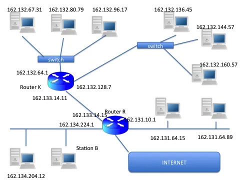

# Exercice 1 :

## Adressage IP et masquage.

### **Indiquer les parties « adresse réseau » et « adresse machine « des adresse IP suivantes, en précisant les masques réseaux.**

a. 113.47.91.75  
Classe A, adresse réseau : 113.0.0.0  
Adresse machine : 0.47.91.75  
Masque réseau : 255.0.0.0

b. 195.183.34.27  
Classe C, adresse réseau : 195.183.34.0  
Adresse machine : 0.0.0.27  
Masque réseau : 255.255.255.0  

c. 149.203.0.0  
Classe B, adresse réseau : 149.203.0.0  
Adresse machine : -  
Masque réseau : 255.255.0.0  

d.  99.47.91.75  
Classe A, adresse réseau : 99.0.0.0  
Adresse machine : 0.47.91.75  
Masque réseau : 255.0.0.0  

### **Proposer une structuration du réseau 147.56.0.0 en 5 sous-réseaux. Donner les masques de chaque sous-réseaux, donner l’adresse IP d’une machine de chaque sous réseaux.**  

Pour diviser en 5 sous-réseaux, il faut utiliser 3 bit de l’adresse machine.
L’adresse est une classe B, donc le masque est 255.255.0.0.  
La nouvelle valeur du masque est : 255.255.224.0  

Maintenant on utilise un codage pour les 5 sous-réseau, en fonction du codage choisit, on déterminera les plages d’adresse IP pour chaque sous-réseau

On utilise 1 bit pour diviser le réseau   

SR 1 : 000 => 147.56.0.1 – 147.56.31.254  
SR 2 : 001 => 147.56.32.1 – 147.56.63.254  
SR 3 : 010 => 147.56.64.1 – 147.56.95.254  
SR 4 : 011 => 147.56.96.1 – 147.56.127.254  
SR 5 : 100 => 147.56.128.1 – 147.56.159.254  

### **Indiquer les différents réseaux et/ou sous-réseaux présents dans le schéma ci-dessous. Donner pour chacun l’adresse réseau et le masque.**

Dans le schéma, il est possible identifier les réseaux suivants   
• R1 : classe B, adresse réseau 162.134.0.0  
• R2 : classe B, adresse réseau 162.131.0.0  
• R3 : classe B, adresse réseau 162.133.0.0  
• R4 : divisé en 2 sous-réseau, SR1 et SR2, car il y a une interface router pour chaque
sous-réseau  
On utilise 1 bit pour diviser le réseau, masque : 255.255.192.0  
o SR1 : 162.131.0.1 – 162.131.127.254   
o SR2 : 162.131.128.1 – 162.131.255.254   

