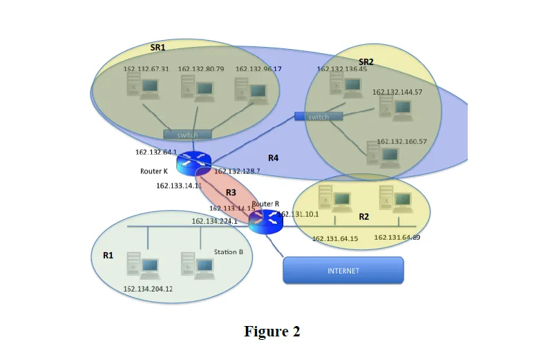
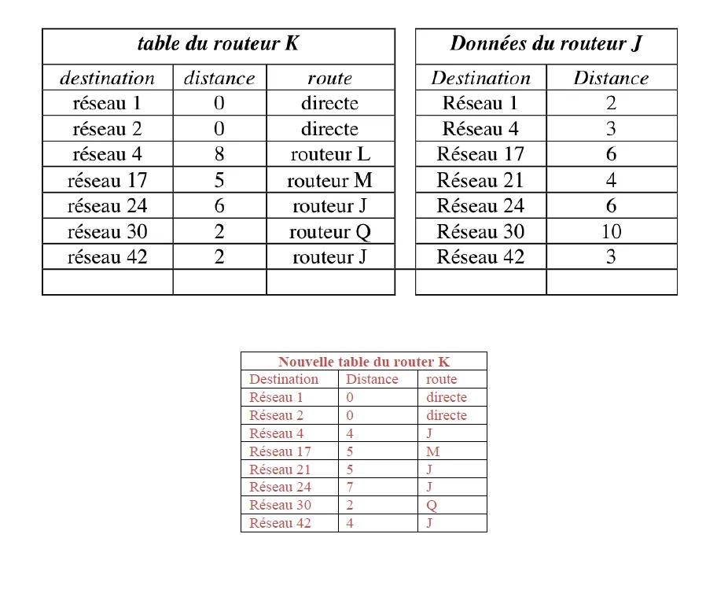
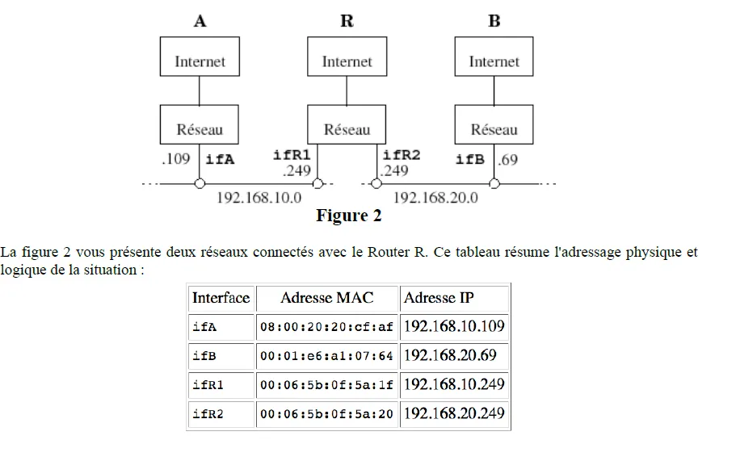

# Exercice 1 :

## Adressage IP et masquage.

### **Indiquer les parties " adresse réseau" et " adresse machine" des adresses IP suivantes, en précisant les masques réseaux.**

a. 113.47.91.75  
Classe A, adresse réseau : 113.0.0.0  
Adresse machine : 0.47.91.75  
Masque réseau : 255.0.0.0

b. 195.183.34.27  
Classe C, adresse réseau : 195.183.34.0  
Adresse machine : 0.0.0.27  
Masque réseau : 255.255.255.0  

c. 149.203.0.0  
Classe B, adresse réseau : 149.203.0.0  
Adresse machine : -  
Masque réseau : 255.255.0.0  

d.  99.47.91.75  
Classe A, adresse réseau : 99.0.0.0  
Adresse machine : 0.47.91.75  
Masque réseau : 255.0.0.0  

### **Proposer une structuration du réseau 147.56.0.0 en 5 sous-réseaux. Donner les masques de chaque sous-réseau, donner l'adresse IP d'une machine de chaque sous-réseau.

Pour diviser en 5 sous-réseaux, il faut utiliser 3 bits de l'adresse machine.
L'adresse est une classe B, donc le masque est 255.255.0.0.  
La nouvelle valeur du masque est : 255.255.224.0 

Maintenant on utilise un codage pour les 5 sous-réseau, en fonction du codage choisit, on déterminera les plages d’adresse IP pour chaque sous-réseau

On utilise 1 bit pour diviser le réseau   

SR 1 : 000 => 147.56.0.1 – 147.56.31.254  
SR 2 : 001 => 147.56.32.1 – 147.56.63.254  
SR 3 : 010 => 147.56.64.1 – 147.56.95.254  
SR 4 : 011 => 147.56.96.1 – 147.56.127.254  
SR 5 : 100 => 147.56.128.1 – 147.56.159.254  

### **Indiquer les différents réseaux et/ou sous-réseaux présents dans le schéma ci-dessous. Donner pour chacun l’adresse réseau et le masque.**

Dans le schéma, il est possible identifier les réseaux suivants   
• R1 : classe B, adresse réseau 162.134.0.0  
• R2 : classe B, adresse réseau 162.131.0.0  
• R3 : classe B, adresse réseau 162.133.0.0  
• R4 : divisé en 2 sous-réseau, SR1 et SR2, car il y a une interface router pour chaque
sous-réseau  
On utilise 1 bit pour diviser le réseau, masque : 255.255.192.0  
o SR1 : 162.131.0.1 – 162.131.127.254   
o SR2 : 162.131.128.1 – 162.131.255.254   

# Exercice 2

## **Voici une illustration d'un échange de table de routage entre un routeur actif (propagation des infos) et un routeur passif (écoute et mise à jour seulement). Le protocole utilisé, RIP, est basé sur le vecteur de distances où la notion de distance désigne le nombre de routeurs à traverser pour atteindre la destination. Construire la nouvelle table de routage du routeur K à partir des données du routeur J.**

  

# Exercice 3 

  

## Questions
Nous faisons les hypothèses suivantes :

1. Les caches “arp” des machines A, B et R sont vides
2. La machine A a connaissance d'une route vers le réseau 192.168.20 passant par 192.168.10.249 et
réciproquement la machine B voit le réseau 192.168.10.0 via le 192.168.20.249
3. La machine A a connaissance de l'adresse IP de la machine B
Déterminer les tables de routage pour A, B et R (routage statique).
Détailler les échanges des données (et le protocole utilisé) dans le cas ou la machine A envoie un datagramme à
la machine B (que se passe t-il sur le réseau ?)  

## Réponses 

### Tables de Routage A

| Réseaux      | Masques        | Passerelle | Interface |
|--------------|----------------|------------|-----------|
| 192.168.10.0 | 255.255.255.0  | Direct     | A         |
| 192.168.20.0 | 255.255.255.0  | Subnet     | R1        |

### Table de Routage B

| Réseaux       | Masques        | Passerelle | Interface |
|---------------|----------------|------------|-----------|
| 192.168.20.69 | 255.255.255.0  | Direct     | B         |
| 192.168.20.249| 255.255.255.0  | Subnet     | R2        |

### Table de routage C

Pour celle-ci, tout est directement connecté.  

a. A envoie un datagramme à B.  

b. L’adresse IP de B appartient à un réseau diffèrent de celui de A : donc inter-routing.  

c. A envoie le datagramme au routeur (intra-routing).  

d. A utilise le protocole ARP pour obtenir l’adresse physique (MAC) du routeur.  

e. A envoie une trame en broadcast (MAC= 11111…111).  

f. Seulement le routeur réponde à A avec son adresse MAC.  

g. A peut transmettre le datagramme au routeur.  

h. Le routeur doit transférer le datagramme vers la machine B (intra-routing à travers l’interface ifR2).  

i. Le routeur utilise le protocole ARP pour obtenir l’adresse physique (MAC) de B.  

j. Le routeur envoie une trame en broadcast (MAC= 11111…111).  

k. Seulement B réponde au routeur avec son adresse MAC

l. Le routeur peut transmettre le datagramme à B.  